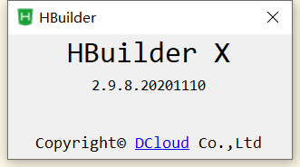

# uni-app打包

因为本次app开发主要应用于安卓设备，故目前主要记录一下安卓相关的打包流程及配置。

## 安卓证书

安卓打包时需要的数字证书可以自己通过java对应的包生成，用于验证开发者的身份，具体操作方式参考[官方文档](https://ask.dcloud.net.cn/article/35777)。需注意JRE版本，环境变量配置。

## 安卓离线打包

### Android Studio

uni-app使用离线打包时需要配置对应目标平台的工程，安卓工程需要使用[Android Studio](https://pan.baidu.com/s/12LevFf_XbgIXDko9bJH05A)(提取码：r1ni)来进行对应打包工程配置。也可前往[安卓中文网](http://www.android-studio.org/index.php/download/hisversion)下载，推荐下载v3.0.1.0版本使用。

### SDK

官网SDK下载地址[https://nativesupport.dcloud.net.cn/AppDocs/download/android](https://nativesupport.dcloud.net.cn/AppDocs/download/android)。
**注意：**SDK下载版本需要和HbuilderX的版本保持一致，如使用的是HbuilderX 2.9.8，就需要下载对应2.9.8的SD!

可通过HbuilderX中点击【帮助】->【关于】查看当前使用的HbuilderX的版本号

### simpleDemo

自HbuilderX 2.7.0之后提供HBuilder-Integrate-AS工程，可以直接导入HBuilder-Integrate-AS工程，直接运行simpleDemo项目即可。
Android项目依赖因为谷歌服务的原因下载相对来说比较慢，并可能会有下载失败的情况。可以使用科学上网的方式下载依赖，也可以[参考此文](https://zhuanlan.zhihu.com/p/26019083)。

依赖下载好之后就可以运行demo项目了，如果需要将自己的app包放到此安卓项目中进行离线打包还需要修改以下内容：

1. simpleDemo\build.gradle applicationId字段改为包名
2. simpleDemo\src\main\AndroidManifest.xml package字段与上方applicationId字段保持一致
3. simpleDemo\src\main\assets\data\dcloud_control.xml appid字段与HbuilderX中的appid保持一致
4. simpleDemo\src\main\res\values\strings.xml 修改对应的app名称
   
然后通过HbuilderX的【发行】-> 【原生app-本地打包】-> 【生成本地打包资源】编译生成对应的编译后文件，然后将与appid一致的文件复制替换到simpleDemo\src\main\assets\apps文件夹下，运行Android Studio打包出对应apk文件即可。

## 参考

- [1] [安卓数字证书](https://ask.dcloud.net.cn/article/35777)
- [2] [dcloud安卓离线打包](https://nativesupport.dcloud.net.cn/AppDocs/usesdk/android)
- [3] [gradle下载加速](https://zhuanlan.zhihu.com/p/26019083)
